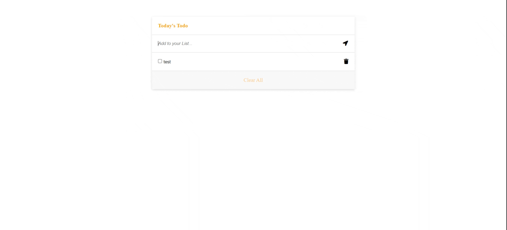

# Todo-list-webpack

> Todo App is for listing tasks. These tasks are stored in the local storage and can be marked as completed, edited and deleted. It is built using JavaScript, jest, HTML and CSS.



## Built With

- Major languages 
  ```bash
  - (HTML, CSS, JavaScript)
  ```


- Frameworks / Libraries
  ```bash
  - Jest
  ```
  
  - Technologies used 
  
  ``` bash
  - Git(version control)
  ```

## Live Demo
[GitHub Pages](https://omarsalem7.github.io/Todo-list-webpack/)<br/>
[Netlify](https://todo-webpack-v1.netlify.app/)


## Getting Started
To get a local copy up and running follow these simple example steps.

### Prerequisites
 - A text editor(preferably Visual Studio Code)

### Install
  -  [Git](https://git-scm.com/downloads)
  -  [Node](https://nodejs.org/en/download/)
### Usage
#### Clone this repository

```bash
$ git clone https://github.com/omarsalem7/Todo-list-webpack.git
$ cd Todo-list-webpack 
```
#### Run project

```bash
$ npm install
$ npm build
$ npm start
```

#### Open page in browser
```bash
$ runs on http://localhost:3000/
```

## Authors

👤 **Omar Salem**

- GitHub: [Omar Salem](https://github.com/omarsalem7)
- Twitter: [Omar Salem](https://twitter.com/Omar80491499)
- LinkedIn: [Omar Salem](https://www.linkedin.com/in/omar-salem-a6945b177/)


## 🤝 Contributing

Contributions, issues, and feature requests are welcome!

Feel free to check the [issues page](../../issues/).

## Show your support

Give a ⭐ if you like this project!

## 📝 License

This project is [Minimalist](https://web.archive.org/web/20180320194056/http://www.getminimalist.com:80/) licensed.
